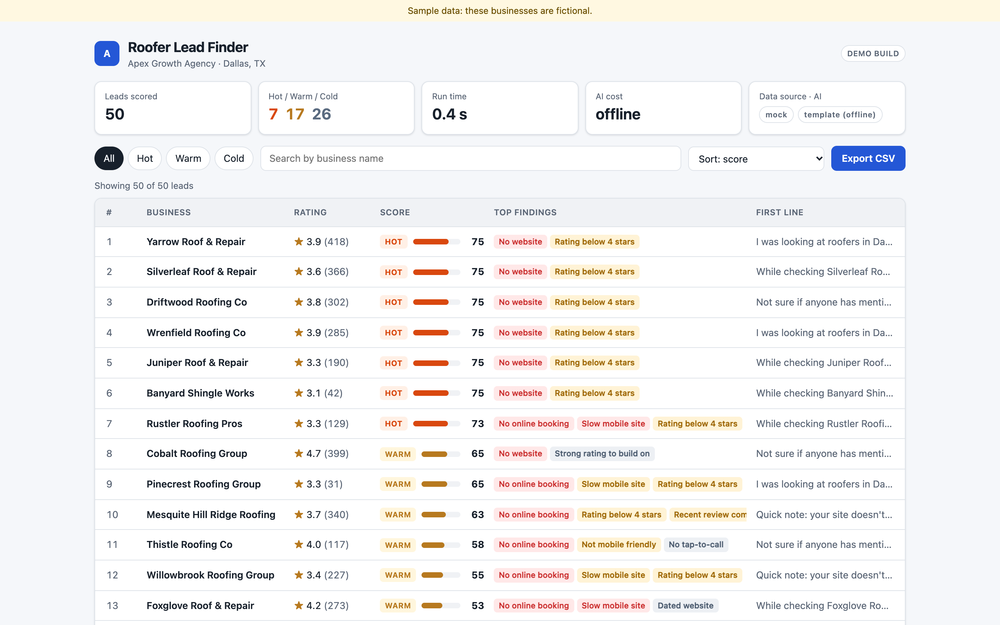
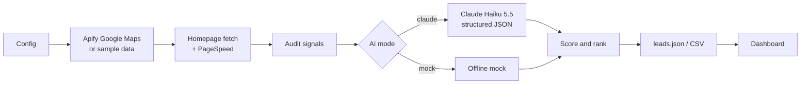

# AI Lead Generation System for Local Businesses

Finds local roofers on Google Maps, audits each one's website and reviews, scores and ranks them, and drafts a personalised cold-email opener and pitch for each lead.

> **Demo build / concept project.** Built for my portfolio around a fictional agency, "Apex Growth Agency". It is not client work, and the public dashboard uses fictional mock data. Nothing is sent automatically.

**Live dashboard (fictional data):** https://moezkayy.github.io/apex-roofing-ai-leadgen/



## What it does

- Pulls Google Maps listings for a search term and city (here: "roofing contractor", Dallas, TX) through Apify, or reads a saved sample file.
- Audits each business: does the website load, is it set up for phones, does it have online booking, how fast is it (Google PageSpeed), plus complaints in recent reviews.
- Scores every lead with a written rubric and sorts them into hot, warm and cold. Each score comes with the reasons behind it.
- Has Claude Haiku 5.5 write a one-line email opener and a short pitch for each lead, using only the facts the audit found.
- Exports `leads.json` and `leads.csv`, and shows them in a static dashboard where you can open a lead and copy the draft.

## Architecture



## Why it's different

Typical Maps-scraper templates dump a list of names and phone numbers. This one:

- **Audits with evidence.** Every claim in a draft points at something that was actually checked, such as a PageSpeed score or a missing booking link. A check that couldn't run is left blank, not guessed.
- **Shows its score reasons.** The rubric is in [`src/score.js`](src/score.js), and every lead lists the points it earned and why.
- **Drafts, not auto-sends.** A human reads every email before anything goes out. This build has no send step.
- **Has a mock mode.** The whole pipeline runs offline with no keys, so it can be demoed or tested for free.
- **Has tested logic.** Normalising, auditing, scoring, prompt building and output are plain JavaScript with unit tests.
- **Reports real cost per run.** Token counts and costs come from the actual run (see below).

## Real test-run metrics

Real runs on 2026-10-08 (from [`media/test-run-metrics.md`](media/test-run-metrics.md)). Demo build, not client results.

| | |
|---|---|
| Data source | Google Maps via Apify ("roofing contractor", Dallas, TX) |
| Leads scored | 50 |
| End-to-end time | 308 s (about 5 min) |
| Tiers (all 50) | 2 hot · 5 warm · 43 cold |
| Claude tokens | 78,855 input · 23,945 output |
| Claude cost | $0.0199 (about $0.0004 per lead) |
| Apify cost | $0.42 |
| PageSpeed | 18 of 50 returned a score; 28 were rate-limited (HTTP 429); 4 failed |
| Kept for the demo | 24 leads with a complete audit; 26 with failed checks dropped |

Quality check: all 50 opening lines were written by Claude, and 49 of 50 were 25 words or fewer. A manual spot check of 5 live leads against their real homepages found 10 of 15 findings correct. The wrong ones came from the simple website-audit rules, not from Claude inventing facts.

Caveats: scores are heuristic, and the website checks are simple HTML rules, so some findings can be wrong.

## Quick start (mock mode, no keys)

Needs Node 24+ and Python 3 (for the local dashboard server).

```bash
npm test
npm run build
npm run n8n
```

1. In the n8n editor, import `n8n/lead-gen-workflow.json` (generated by `npm run build`).
2. Click **Execute workflow**. It reads `data/sample_roofers.json` and writes `output/leads.json` and `output/leads.csv`.
3. View the results:

```bash
npm run dashboard
```

The dashboard reads `docs/leads.json`, which is fictional mock data. The public repo ships `n8n/lead-gen-workflow.public.json`, which has a `__REPO__` placeholder instead of a file path. `npm run build` replaces the placeholder with your local path and writes `n8n/lead-gen-workflow.json` (git-ignored).

## Real mode

Create three credentials in n8n (Credentials → New):

| Credential | Type in n8n | Where to get it |
|---|---|---|
| Apify token | Header Auth: name `Authorization`, value `Bearer ` followed by your token | Apify Console → Settings → API & Integrations |
| Anthropic key | Anthropic account | console.anthropic.com → API keys |
| PageSpeed key | Query Auth: name `key`, value your key | Google Cloud Console → enable the PageSpeed Insights API → Credentials |

Then attach each credential to its node (Apify: Google Maps, Claude, PageSpeed) and edit the **Config** node:

| Field | Meaning |
|---|---|
| `dataSource` | `mock` (sample file) or `apify` |
| `ai` | `mock` (offline templates) or `claude` |
| `city`, `searchTerm` | What to search on Google Maps |
| `limit` | Max leads (default 50) |
| `model` | Claude model ID (default `claude-haiku-5-5`) |
| `agencyName`, `agencyOffer` | Who the emails are from and what they sell |

## Costs

- Apify: free plan includes $5/month of credit. The 50-lead test run cost $0.42.
- PageSpeed Insights: free (it rate-limited 28 of 50 requests in my run, so expect gaps without pacing or retries).
- n8n: free when self-hosted.
- Claude Haiku 5.5: $0.0199 for the 50-lead run (about 2 cents).

## Project layout

```
src/        plain JS logic: normalize, audit, score, prompt, mock_ai, output
n8n/        workflow.src.json (source) and lead-gen-workflow.public.json (build output)
scripts/    build_workflow.mjs, n8n.sh, helper scripts
tests/      node:test unit tests
data/       sample_roofers.json (fictional sample listings)
docs/       static dashboard + fictional leads.json (GitHub Pages)
media/      screenshots, test-run metrics, prompt notes, demo script
```

**How the build works:** n8n Code nodes can't import files, so `scripts/build_workflow.mjs` finds each `// @include src/....js` line in `workflow.src.json` and pastes that file's content in (cut at `// @n8n-strip-below`). The same code that the tests exercise is what runs in n8n.

**Testing:** `npm test` runs the Node test runner over `tests/*.test.js`. Prompt design notes are in [`media/prompt-notes.md`](media/prompt-notes.md).

## Compliance notes

- Scraping Google Maps through Apify is subject to Google's and Apify's terms of service. Check them before running it for real.
- Cold email must follow CAN-SPAM (US) and similar laws elsewhere: honest sender details, a clear opt-out, and respect for opt-outs.
- Nothing is sent automatically. Drafts are for a human to review.

## License

MIT, see [LICENSE](LICENSE).
